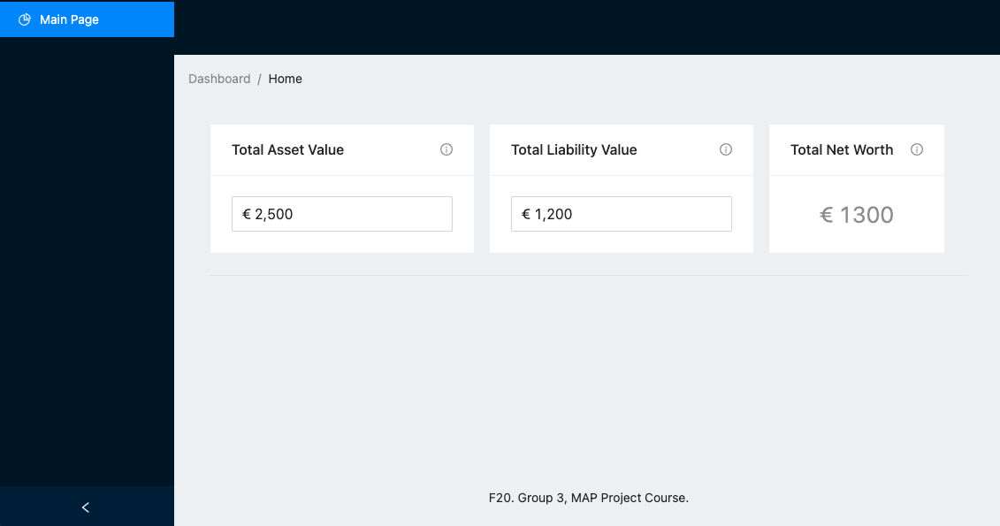
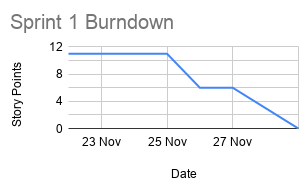
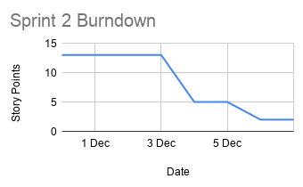
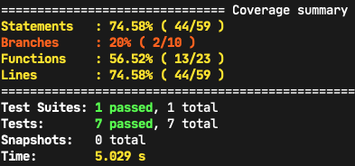
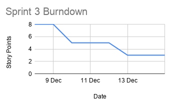

# Team 3 group project: Net Worth Tracker

A Net Worth Tracker (Manager) is an app that allows users to calculate and see their net worth over time. A user would add their assets and liabilities and the tool would allow them to easily comprehend the results.

## Project UI (after Sprint 2)

The website can be accessed on this link: [https://map-course-app.web.app/](https://map-course-app.web.app/).



## Team Members

- Svyatoslav Semenyuk (@Prometheus3375)
- Dragos Strugar (@d11r)
- Alexey Logachev (@picroc)

## Technologies

We discussed between making a desktop app or a web application. Tradeoffs included things like privacy, platform independence, ease of use, etc. After careful consideration we decided to make a web application with a cloud-stored database. We realize that the privacy is the main aspect of our product: users do **not** want their data to be seen by anyone except themselves, so we will implement additional privacy measures.

To make a web app, it is best to use JavaScript, so we decided to use _React_ as our frontend framework to use. For the database, we will use Firebase.

## Organization

Daily meetings, retrospective, sprint planning, and sprint review are all planned and scheduled as follows:

- daily meetings at 7pm MSC every working day
- sprint planning on Monday in the mornings
- sprint review on Friday in the evenings
- sprint restrospect after each sprint review

## Running the app

Make sure you have Node.js installed on your system (along with NPM). If not, please visit [this link](https://nodejs.org/en/download/) for additional instructions. Now, install yarn if you don't have it. To see installation instructions for Yarn, please visit [this link](https://classic.yarnpkg.com/en/docs/install).

Please note that on Mondays the could should be reviewed and put on the `main` branch. However, it may not be as some of the members have full-time jobs.

After that, clone our repository, and run the following (make sure you have `yarn` in your PATH and `cd` is for UNIX, so use Windows alternative if your OS is Windows):

```
cd net-worth-tracker
yarn && yarn start
```

The local server should be up and running. For more information on code structure, and quality assurance, please visit our wiki page [on this link](https://github.com/IU-IPOD-F20/map-projects-team3/wiki/Net-Worth-Tracker-Documentation).

## Overviews of Sprints

This section helps us, as well as the professor, in navigating the current stage of the project. We have two [projects](https://github.com/IU-IPOD-F20/map-projects-team3/projects) created, one with user stories and one with github issues. There you can also track our progress and how far we've come.

Below is the summary in terms of Story Points and effort needed to perform different tasks.

### Sprint 1

In total this sprint required 11 story points. There were three tasks, with weights of 5, and two with weight of 3. We managed to finish all the tasks that we've set out to do. While the prototype is very basic at this point, it fulfills all the requirements that the client has defined.



### Sprint 2

In this week we were unable to finish all the tasks that we set for ourselves, but we did in fact provide a fully-functioning prototype, still. In this sprint we set up automatic deployment with testing checks. In addition, we worked on the architecture and initial entities for our application. The result can be found on this link: [https://map-course-app.web.app/](https://map-course-app.web.app/).



We also now support code coverage reporting. Our results for now aren't impressive, but we hope to expand on this matter and improve. Here are the initial results with just testing if components are adequately mounting to the screen



### Sprint 3

In this sprint we primarily worked on the integration between our frontend and the backend. There was a lot of work in configuring the communication to work flawlessly.

_Frontend_: communication with the backend service. Done via using React’s Context API. Reusable methods for data fetching, standardised.

_Backend_: allowed cross origin resource sharing, and ensured secure communication by using https.

Added main authentication and authorisation functionalities. Now users could use these endpoints to access the data stored in our backend.

However, we _couldn’t manage to fit in deploying the new backend version to the production_, so we ran the server on our local machines. This of course means that the production version is not ready to be deployed, as there would be no server to connect to.

Next steps would be to deploy the backend so it is readily reachable from the frontend application.

As the Burndown chart suggests, this week we took on fewer number of tasks due to our other final exams and projects. And still we didn't manage to fulfill all the tasks that we set out to do. However, we're still providing our users with a product that holds value to them, but in our eyes we did not manage to increase value this sprint. Note that the last 3 story points if we completed them, they would bring value to our customers.



## Sprint Reviews


